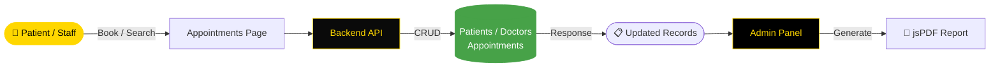

<div align="center">


[](https://git.io/typing-svg)


<br/>

<p align="center">
  <a href="https://github.com/NietoDeveloper">
    
  </a>
  <a href="https://committers.top/colombia#NietoDeveloper">
    
  </a>
  <a href="https://react.dev/">
    
  </a>
  <a href="https://nodejs.org/">
    
  </a>
  <a href="https://opensource.org/licenses/MIT">
    
  </a>
</p>


<p align="center">
  <a href="https://github.com/NietoDeveloper/HealthServices">
    
  </a>
</p>

</div>

---

## 📋 Overview

**HealthHub** is a comprehensive React-based hospital management system designed to streamline healthcare operations and improve patient care. This system provides an intuitive interface for managing appointments, patient records, doctor information, and administrative tasks.

---

## 🗂️ Project Structure

```text
HealthServices/
├── Backend/
│   └── api/
│       ├── controllers/     # Business logic handlers
│       ├── models/           # Database models
│       └── routes/            # RESTful API endpoints
└── Frontend/
    ├── .vscode/
    ├── models/
    ├── public/
    └── src/
        ├── app/
        │   ├── api/
        │   │   └── auth/       # Auth API routes
        │   └── auth/            # Auth views
        ├── assets/
        ├── components/
        ├── context/
        ├── hooks/
        ├── pages/
        └── Styles/
    └── utils/
```


---

## 🔄 Appointment & Records Flow



---


## ✨ Features

- **User-Friendly Interface:** Clean and responsive design for easy navigation across devices.
- **Appointment Management:** Schedule and manage patient appointments efficiently.
- **Patient Records:** Maintain detailed patient information and medical history.
- **Doctor Directory:** Access a list of doctors with their specialties and patient counts.
- **Administrative Tools:** Secure admin panel for overseeing system operations and generating reports.
- **Responsive Design:** Optimized for both desktop and mobile devices.

---

## 📄 Pages

| Page | Description |
|:-----|:-------------|
| **Home** | Welcome page with quick access to key features |
| **Appointments** | Book and manage patient appointments |
| **Patients** | Add, edit, and manage patient records |
| **Doctors** | View and manage doctor information |
| **Admin** | Secure login for administrative tasks and report generation |

---

## 🛠️ Technologies Used

<div align="center">

| Layer | Technologies |
|:------|:-------------|
| 🎨 **Frontend** | React.js, JavaScript (ES6+), HTML5, CSS3 |
| 🎯 **Icons** | Font Awesome |
| 📄 **Reporting** | jsPDF for PDF report generation |
| ⚙️ **Backend** | Node.js API (controllers, models, routes) |

</div>

---